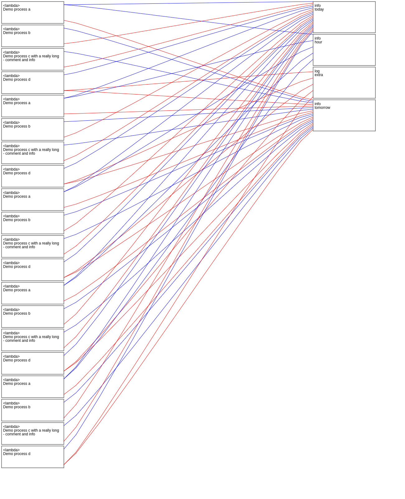

# Build Steps
1. `bumpversion <major|minor|patch>`
2. `python setup.py sdist bdist_wheel`

## Process Runners to update state
Pure functions should not modify the state. Instead they should return a copy of the state.

Each function should take the input state and output a modified copy of that state without effecting the original state. The global state can be then set to equal this new state. This ensures that we can easily test each process and be explicit on what it is modifying.


### Process runner
```
Initial State ===> [Process 1] ====> New state
New State ===> [Process 2] ====> New state
New State ===> [Process 3] ====> New state
New State ===> [Process 4] ====> Output State
```

Through the use of functools.reduce we can create a process runner that will run a
set of processes in turn on a state.

The process runner takes a list of processes and returns a function that takes the previous state and current process id.

Example runner:
``` python
def run_process(prev_state, process):
    """used in a reduce function to take previous state
    and pass to next function"""
    return process(prev_state)

def run_hour(processes):
    """Take a set of processes and return the process runner"""
    def run_processes(initial_state: Model_State_Shape, hr: int) -> Model_State_Shape:
        """ Takes the initial state at start of hour and the hour number"""
        new_state = reduce(run_process, processes, initial_state)
        return new_state
    return run_processes
```

To use the runner:
``` python

def example_process(prev_state):
    # do some stuff to the state
    return new_state

initial_state = Model_State_Shape(1)
hr = 1

output_state = run_hour([
    example_process,
])(initial_state, hr)
```

# Example State
...

# Example Processes
```Python
from proflow.Objects import Process, I

processes = [
    Process(
        func=lambda x, y, z: x + y + z,
        comment="Demo process a",
        config_inputs=[
            I('foo.bar', as_='x'),
        ],
        state_inputs=[
            I('info.today', as_='y'),
            I('info.hour', as_='z')
        ],
        state_outputs=[
            I('_result', as_='info.tomorrow'),
        ]
    ),
    Process(
        func=lambda x, y: x + y,
        comment="Demo process b",
        config_inputs=[
            I('foo.bar', as_='x'),
        ],
        state_inputs=[
            I('info.tomorrow', as_='y'),
        ],
        state_outputs=[
            I('_result', as_='info.today'),
        ]
    ),
    Process(
        func=lambda x, y: x + y,
        comment="Demo process c with a really long comment and info",
        config_inputs=[
            I('foo.bar', as_='x'),
        ],
        state_inputs=[
            I('info.tomorrow', as_='y'),
        ],
        state_outputs=[
            I('_result', as_='info.today'),
        ]
    ),
    Process(
        func=lambda x, y: x + y,
        comment="Demo process d",
        config_inputs=[
            I('foo.bar', as_='x'),
        ],
        state_inputs=[
            I('info.today', as_='y'),
        ],
        state_outputs=[
            I('_result', as_='info.tomorrow'),
            I('_result', as_='log.extra'),
        ]
    ),
]

```

# Process Attributes:

## func
**Callable[[Model_State_Shape], Model_State_Shape]**

The function to call

---
## gate
`bool default = True`

if False process is skipped

---
## comment
`str default = ""`
used for logging

---
## config_inputs
`List[I] default = []`
Dot notation config inputs

---
## parameters_inputs
`List[I] default = []`

---
## external_state_inputs
`List[I] default = []`

---
## additional_inputs
`List[tuple] default = []`

---
## state_inputs
`List[I] default = []`

---
## state_outputs
`List[I] default = []`

---
## args
`List[any] default = []`

---
additional args


# Analysis Of Processes
In the experiments directory are some example of using the analysis tools

## Link state and processes
